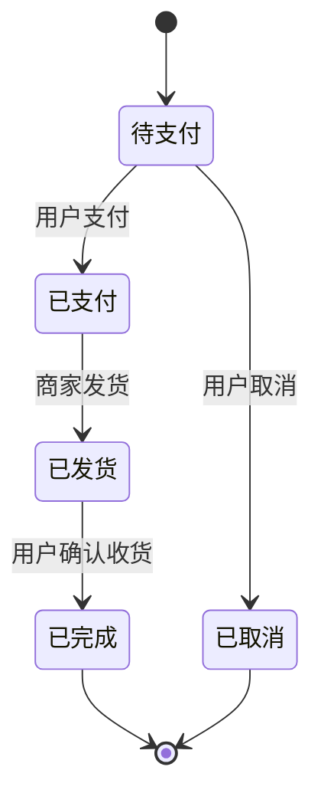

# 电商购物平台 - 产品需求文档 (PRD)

## 1. 项目概述

本项目是一个基于Vue的电商购物平台，采用前后端分离架构，提供商品展示、搜索、购物车、下单和订单管理等核心功能。

## 2. 功能需求

### 2.1 商品展示

| 需求编号 | 需求描述 | 优先级 |
| :--- | :--- | :--- |
| PRD-001 | 用户进入首页或分类页时，能看到商品列表（支持分页、排序） | 高 |
| PRD-002 | 点击商品后进入详情页，查看商品大图、价格、库存、描述等信息 | 高 |

### 2.2 商品搜索

| 需求编号 | 需求描述 | 优先级 |
| :--- | :--- | :--- |
| PRD-003 | 用户可通过顶部搜索框输入关键词查找商品 | 高 |
| PRD-004 | 系统需支持按价格区间、销量、综合评分等进行排序筛选 | 高 |

### 2.3 购物车功能

| 需求编号 | 需求描述 | 优先级 |
| :--- | :--- | :--- |
| PRD-005 | 用户可将商品加入购物车 | 高 |
| PRD-006 | 用户可修改购物车中商品数量 | 高 |
| PRD-007 | 用户可删除购物车中的商品 | 高 |
| PRD-008 | 购物车需展示小计金额 | 高 |

### 2.4 下单流程

| 需求编号 | 需求描述 | 优先级 |
| :--- | :--- | :--- |
| PRD-009 | 用户从购物车确认购买信息（地址、商品、数量） | 高 |
| PRD-010 | 生成订单，订单状态变为"待支付" | 高 |

### 2.5 订单管理

| 需求编号 | 需求描述 | 优先级 |
| :--- | :--- | :--- |
| PRD-011 | 用户可在个人中心查看所有订单 | 高 |
| PRD-012 | 用户可根据订单状态进行筛选（待支付、已支付、已发货、已完成、已取消） | 高 |
| PRD-013 | 用户可进行订单操作（如取消订单） | 高 |

### 2.6 用户管理

| 需求编号 | 需求描述 | 优先级 |
| :--- | :--- | :--- |
| PRD-014 | 用户登录功能 | 高 |
| PRD-015 | 用户注册功能 | 高 |
| PRD-016 | 用户个人信息管理 | 中 |
| PRD-017 | 用户地址管理 | 高 |

## 3. 页面结构

| 页面名称 | 页面功能 | 所属模块 |
| :--- | :--- | :--- |
| 首页 | 商品分类导航、推荐商品、活动展示 | 首页模块 |
| 商品列表页 | 分类商品展示、筛选排序 | 商品模块 |
| 商品详情页 | 商品信息、规格选择、加入购物车 | 商品模块 |
| 购物车页面 | 商品列表、数量调整、结算 | 购物车模块 |
| 订单确认页 | 地址选择、支付方式选择、订单信息确认 | 订单模块 |
| 订单管理页 | 订单列表、订单详情 | 订单模块 |
| 用户中心 | 个人信息、地址管理、收藏等 | 用户模块 |

## 4. 用户角色

| 角色 | 权限 |
| :--- | :--- |
| 游客 | 浏览商品、查看商品详情 |
| 登录用户 | 浏览商品、加入购物车、下单、管理订单 |

## 5. 数据实体

### 5.1 用户表 (user)

| 字段名 | 类型 | 说明 |
| :--- | :--- | :--- |
| id | Long | 用户ID |
| username | String | 用户名 |
| password | String | 密码（加密） |
| email | String | 邮箱 |
| phone | String | 手机号 |
| create_time | DateTime | 创建时间 |

### 5.2 商品表 (product)

| 字段名 | 类型 | 说明 |
| :--- | :--- | :--- |
| id | Long | 商品ID |
| name | String | 商品名称 |
| price | BigDecimal | 价格 |
| stock | Integer | 库存 |
| description | String | 描述 |
| image | String | 图片URL |
| category_id | Long | 分类ID |
| sales | Integer | 销量 |
| rating | BigDecimal | 评分 |
| create_time | DateTime | 创建时间 |

### 5.3 分类表 (category)

| 字段名 | 类型 | 说明 |
| :--- | :--- | :--- |
| id | Long | 分类ID |
| name | String | 分类名称 |
| parent_id | Long | 父分类ID |
| sort_order | Integer | 排序 |

### 5.4 购物车表 (cart)

| 字段名 | 类型 | 说明 |
| :--- | :--- | :--- |
| id | Long | 购物车ID |
| user_id | Long | 用户ID |
| product_id | Long | 商品ID |
| quantity | Integer | 数量 |

### 5.5 订单表 (order)

| 字段名 | 类型 | 说明 |
| :--- | :--- | :--- |
| id | Long | 订单ID |
| user_id | Long | 用户ID |
| address_id | Long | 地址ID |
| total_amount | BigDecimal | 总金额 |
| status | String | 订单状态 |
| create_time | DateTime | 下单时间 |
| pay_time | DateTime | 支付时间 |
| ship_time | DateTime | 发货时间 |
| complete_time | DateTime | 完成时间 |

### 5.6 订单商品表 (order_item)

| 字段名 | 类型 | 说明 |
| :--- | :--- | :--- |
| id | Long | 订单商品ID |
| order_id | Long | 订单ID |
| product_id | Long | 商品ID |
| quantity | Integer | 数量 |
| price | BigDecimal | 价格 |

### 5.7 地址表 (address)

| 字段名 | 类型 | 说明 |
| :--- | :--- | :--- |
| id | Long | 地址ID |
| user_id | Long | 用户ID |
| receiver | String | 收件人 |
| phone | String | 手机号 |
| province | String | 省份 |
| city | String | 城市 |
| district | String | 区/县 |
| detail | String | 详细地址 |
| is_default | Boolean | 是否默认地址 |

## 6. 订单状态流转

## 7. 非功能需求

| 需求类型 | 描述 |
| :--- | :--- |
| 性能需求 | API响应时间 < 200ms |
| 并发需求 | 支持1000+并发用户 |
| 兼容性 | 支持主流浏览器（Chrome、Firefox、Safari、Edge） |
| 安全性 | 用户密码加密存储，接口需登录验证 |