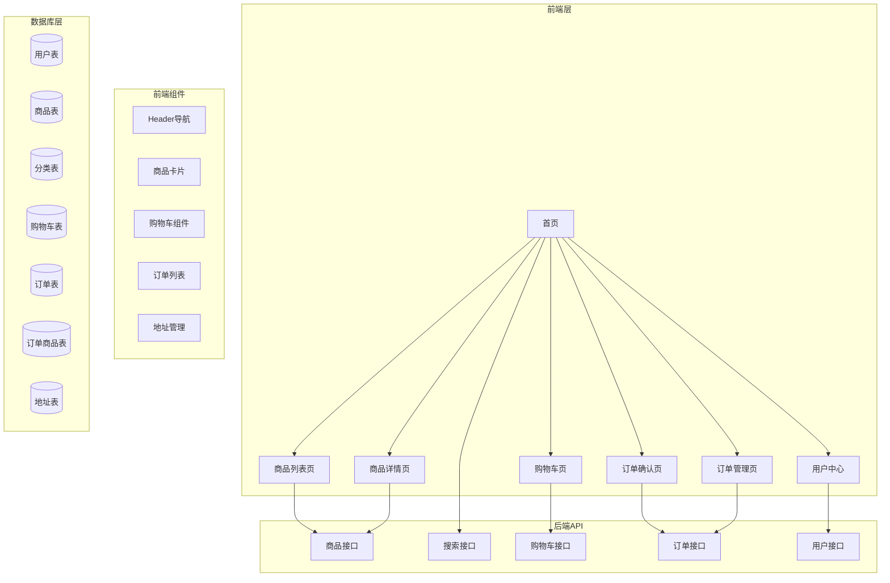

# 电商购物平台 - 技术架构文档

## 1. 架构概述

本项目采用前后端分离架构，前端基于Vue 3 + TypeScript构建，后端采用Node.js + Express提供RESTful API，使用SQLite作为数据库（开发环境）。

## 2. 技术选型

| 分类 | 技术 | 版本 | 说明 |
| :--- | :--- | :--- | :--- |
| 前端框架 | Vue | 3.4.x | 渐进式JavaScript框架 |
| 前端语言 | TypeScript | 5.x | 类型安全 |
| 构建工具 | Vite | 6.x | 快速构建工具 |
| 样式框架 | TailwindCSS | 3.x | 原子化CSS框架 |
| 状态管理 | Pinia | 2.x | Vue官方状态管理 |
| 路由 | Vue Router | 4.x | Vue路由管理 |
| UI组件 | Element Plus | 2.x | Vue 3组件库 |
| 后端框架 | Express | 4.x | Node.js Web框架 |
| 数据库 | SQLite | 3.x | 轻量级数据库（开发环境） |
| ORM | Prisma | 5.x | 数据库ORM工具 |

## 3. 架构图



## 4. 目录结构

```
shopping-platform/
├── frontend/                    # 前端项目
│   ├── src/
│   │   ├── components/          # 公共组件
│   │   │   ├── Header.vue       # 顶部导航
│   │   │   ├── Footer.vue       # 页脚
│   │   │   ├── ProductCard.vue  # 商品卡片
│   │   │   └── CartItem.vue     # 购物车项
│   │   ├── views/               # 页面视图
│   │   │   ├── Home.vue         # 首页
│   │   │   ├── ProductList.vue  # 商品列表页
│   │   │   ├── ProductDetail.vue# 商品详情页
│   │   │   ├── Cart.vue         # 购物车页
│   │   │   ├── OrderConfirm.vue # 订单确认页
│   │   │   ├── OrderList.vue    # 订单列表页
│   │   │   └── UserCenter.vue   # 用户中心
│   │   ├── stores/              # Pinia状态管理
│   │   │   ├── user.ts          # 用户状态
│   │   │   ├── cart.ts          # 购物车状态
│   │   │   └── order.ts         # 订单状态
│   │   ├── api/                 # API接口
│   │   │   ├── products.ts      # 商品API
│   │   │   ├── cart.ts          # 购物车API
│   │   │   ├── orders.ts        # 订单API
│   │   │   └── users.ts         # 用户API
│   │   ├── types/               # TypeScript类型定义
│   │   │   └── index.ts         # 类型定义
│   │   ├── utils/               # 工具函数
│   │   │   └── request.ts       # 请求封装
│   │   ├── App.vue              # 根组件
│   │   └── main.ts              # 入口文件
│   ├── public/                  # 静态资源
│   ├── index.html               # HTML模板
│   ├── package.json             # 依赖配置
│   ├── vite.config.ts           # Vite配置
│   └── tsconfig.json            # TypeScript配置
├── backend/                     # 后端项目
│   ├── src/
│   │   ├── controllers/         # 控制器
│   │   ├── routes/              # 路由
│   │   ├── models/              # 数据模型
│   │   ├── services/            # 业务逻辑
│   │   ├── middlewares/         # 中间件
│   │   ├── config/              # 配置文件
│   │   └── app.ts               # 应用入口
│   ├── prisma/                  # Prisma配置
│   ├── package.json             # 依赖配置
│   └── tsconfig.json            # TypeScript配置
└── README.md                    # 项目说明
```

## 5. API接口设计

### 5.1 商品接口

| 方法 | 路径 | 说明 |
| :--- | :--- | :--- |
| GET | /api/products | 获取商品列表（支持分页、筛选、排序） |
| GET | /api/products/:id | 获取商品详情 |
| GET | /api/products/categories | 获取商品分类 |

### 5.2 搜索接口

| 方法 | 路径 | 说明 |
| :--- | :--- | :--- |
| GET | /api/search | 关键词搜索商品 |

### 5.3 购物车接口

| 方法 | 路径 | 说明 |
| :--- | :--- | :--- |
| GET | /api/cart | 获取购物车列表 |
| POST | /api/cart | 添加商品到购物车 |
| PUT | /api/cart/:id | 更新购物车商品数量 |
| DELETE | /api/cart/:id | 删除购物车商品 |
| DELETE | /api/cart | 清空购物车 |

### 5.4 订单接口

| 方法 | 路径 | 说明 |
| :--- | :--- | :--- |
| GET | /api/orders | 获取订单列表 |
| GET | /api/orders/:id | 获取订单详情 |
| POST | /api/orders | 创建订单 |
| PUT | /api/orders/:id/cancel | 取消订单 |
| PUT | /api/orders/:id/pay | 支付订单 |

### 5.5 用户接口

| 方法 | 路径 | 说明 |
| :--- | :--- | :--- |
| POST | /api/users/register | 用户注册 |
| POST | /api/users/login | 用户登录 |
| GET | /api/users/me | 获取当前用户信息 |
| PUT | /api/users/me | 更新用户信息 |
| GET | /api/users/addresses | 获取用户地址列表 |
| POST | /api/users/addresses | 添加地址 |
| PUT | /api/users/addresses/:id | 更新地址 |
| DELETE | /api/users/addresses/:id | 删除地址 |

## 6. 数据模型

### 6.1 User（用户）

```typescript
interface User {
  id: number;
  username: string;
  password: string;
  email: string;
  phone: string;
  createdAt: Date;
}
```

### 6.2 Product（商品）

```typescript
interface Product {
  id: number;
  name: string;
  price: number;
  stock: number;
  description: string;
  image: string;
  categoryId: number;
  sales: number;
  rating: number;
  createdAt: Date;
}
```

### 6.3 Category（分类）

```typescript
interface Category {
  id: number;
  name: string;
  parentId: number | null;
  sortOrder: number;
}
```

### 6.4 CartItem（购物车项）

```typescript
interface CartItem {
  id: number;
  userId: number;
  productId: number;
  quantity: number;
}
```

### 6.5 Order（订单）

```typescript
interface Order {
  id: number;
  userId: number;
  addressId: number;
  totalAmount: number;
  status: 'pending' | 'paid' | 'shipped' | 'completed' | 'cancelled';
  createdAt: Date;
  payTime: Date | null;
  shipTime: Date | null;
  completeTime: Date | null;
}
```

### 6.6 OrderItem（订单商品）

```typescript
interface OrderItem {
  id: number;
  orderId: number;
  productId: number;
  quantity: number;
  price: number;
}
```

### 6.7 Address（地址）

```typescript
interface Address {
  id: number;
  userId: number;
  receiver: string;
  phone: string;
  province: string;
  city: string;
  district: string;
  detail: string;
  isDefault: boolean;
}
```

## 7. 安全方案

| 安全措施 | 说明 |
| :--- | :--- |
| JWT认证 | 使用JWT token进行用户身份验证 |
| 密码加密 | 使用bcrypt对用户密码进行加密存储 |
| 请求限流 | 防止恶意请求攻击 |
| 输入验证 | 对所有输入参数进行验证 |
| CORS配置 | 配置跨域访问白名单 |

## 8. 部署方案

### 8.1 开发环境

- 前端：`npm run dev`（本地开发服务器）
- 后端：`npm run dev`（本地API服务器）
- 数据库：SQLite（文件型数据库，无需额外服务）

### 8.2 生产环境

- 前端：构建后部署到Nginx或CDN
- 后端：部署到Node.js服务器（如PM2管理）
- 数据库：MySQL或PostgreSQL