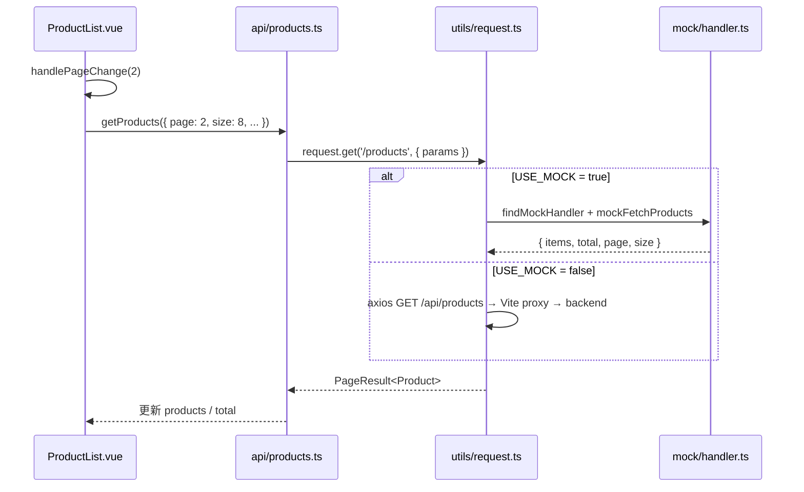

# 异步请求功能实现思路

> 本项目使用 TypeScript，请求工具文件为 `src/utils/request.ts`（等价于常见的 `request.js` 封装）。

## 需求对照检查

| 要求项 | 是否实现 | 对应实现 |
| --- | --- | --- |
| 为电商前端添加异步请求功能 | ✅ | 全站 API 均通过 `async/await` + `request` 发起异步请求 |
| 封装独立请求工具（如 request.js） | ✅ | `src/utils/request.ts`：axios 实例、拦截器、统一 `get/post/put/delete` |
| 对接 API 接口或 Mock 数据 | ✅ | 开发环境默认 Mock；`VITE_USE_MOCK=false` 时走真实 `backend/server.js` |
| 商品列表分页查询 | ✅ | `ProductList.vue` 传 `page`/`size`；Mock/后端均 `slice` 分页返回 |
| 商品列表分类筛选 | ✅ | 传 `categoryId`；Mock/后端均按分类过滤 |
| Mock 下「访问一页发送一次请求」 | ✅ | 翻页/筛选/搜索均调用 `loadProducts()` → 每次独立 Mock 请求，Console 可见 `[Mock][#n]` 日志 |
| 文档说明实现思路 | ✅ | 本文档 + README「异步请求与 Mock」章节 |

**结论：上述要求均已实现，可直接用于演示与验收。**

## 一、整体设计

为电商前端添加独立的请求工具层与 Mock 数据机制，形成 **"请求封装层 → API 业务层 → 页面视图"** 的单向依赖，使商品列表的分页查询、分类筛选、关键字搜索均走同一条异步数据通路，保证"访问一页发送一次请求"。

```
┌──────────────┐   ┌──────────────┐   ┌─────────────────────┐   ┌─────────────┐
│  ProductList │ ─▶│  api/products│ ─▶│  utils/request.ts   │ ─▶│ 真实后端 API│
│   (视图)     │   │  (业务层)    │   │  (请求工具/Mock路由)│   │ 或 Mock 数据│
└──────────────┘   └──────────────┘   └─────────────────────┘   └─────────────┘
```

### 请求时序（以翻页为例）



## 二、文件清单与职责

| 文件相对路径 | 职责 |
| --- | --- |
| `src/utils/request.ts` | **独立请求工具**：封装 axios，统一拦截器、token、错误处理；并内置 Mock 路由分发能力 |
| `src/mock/data.ts` | Mock 数据源与各接口 handler（`mockFetchProducts` 等），内置 `delay` 模拟网络延迟 |
| `src/mock/handler.ts` | Mock 路由注册表：基于 `method + path` 匹配到对应 handler，实现"访问一页发送一次请求" |
| `src/api/products.ts` | 业务 API 层：只调用 `request.get/post`，不关心数据来自真实后端还是 Mock |
| `src/stores/catalog.ts` | 分类数据 store，缓存 `getCategories()` 结果 |
| `src/views/ProductList.vue` | 商品列表页：分页/分类/搜索/排序的 UI 与状态管理 |

## 三、关键实现要点

### 1. request.ts —— 独立请求工具

- 基于 axios 创建实例：`baseURL: '/api'`，10s 超时。
- 请求拦截器自动注入 `Authorization: Bearer <token>`。
- 响应拦截器统一处理 401/403/500，配合 `ElMessage` 弹出错误提示。
- **Mock 切换开关**：`USE_MOCK = VITE_USE_MOCK === 'true' || MODE === 'development'`。在开发环境默认启用 Mock，无需真实后端也可完整演示。
- **统一出口**：对外暴露 `get / post / put / delete` 四个方法，业务层只与这四个方法打交道。
- **Mock 路由分发**：`mockAdapter` 先调用 `findMockHandler(method, path)` 查找 Mock；若未命中则回退到真实 axios 请求，Mock 与真实后端可共存于同一套接口。
- **请求日志**：每次 Mock 调用打印 `[Mock][#n] GET /products`，方便确认"翻页 = 一次请求"。

### 2. Mock 数据与 Handler（保证"访问一页发送一次请求"）

- `data.ts` 维护 54 条商品与 5 个分类，字段结构与真实后端 `server.js` 完全一致（id、name、price、stock、description、image、categoryId、sales、rating、createdAt）。
- 每个 Mock handler 都是 **异步函数**，通过 `delay()` 模拟 150–450ms 的随机网络延迟。
- **分页筛选全部在 handler 内完成**：
  - `page` / `size` → slice 分页；
  - `categoryId` → 过滤 `categoryId` 字段；
  - `keyword` → 对 `name`、`description` 做大小写不敏感的 `includes`；
  - `sortBy` + `sortOrder` → 动态字段排序。
- **契约与真实后端一致**：返回 `{ code, data: { items, total, page, size }, message, success }`，`success:false` 时在 `request.ts` 内统一抛错并走错误拦截逻辑。
- `handler.ts` 以"注册表"的形式声明路由，便于后续扩展（如新增 `POST /products` 直接追加一条 handler 即可）。
- 购物车（`/cart`）与收藏（`/wishlist`）同样已注册 Mock handler，**登录状态下浏览商品列表不会再因后端未启动而弹出 500 错误**。

### 错误提示去重

`request.ts` 响应拦截器对 500 错误只弹出一条「服务器错误，请稍后重试」，不再重复显示 axios 原始错误信息；网络不可达时提示「请检查后端服务是否已启动」。

### 3. api/products.ts —— 业务 API 层

只做一件事：把页面需要的请求参数透传给 `request`，并把返回值断言成业务类型：

```ts
export function getProducts(params?: { page?; size?; categoryId?; keyword?; sortBy?; sortOrder? }) {
  return request.get<PageResult<Product>>('/products', { params })
}
```

该层 **不直接持有任何商品数据**，所有数据来自 `request` 返回，从而确保"翻页/筛选"必然触发一次异步请求（Mock 或真实）。

### 4. ProductList.vue —— 状态与交互闭环

- 所有筛选条件收敛到一个 `filters` 对象（`categoryId`、`keyword`、`sortBy`、`sortOrder`），**分类/搜索/排序统一作为 `getProducts(params)` 的入参**（方案 A：全部走服务端/Mock 过滤）。
- 分类、排序、搜索的 `handleXxx` 方法在调用 `loadProducts()` 前先把 `currentPage` 重置为 1，避免"筛选后页数不足导致空列表"。
- `loadProducts()` 使用 `try/catch/finally`：
  - 成功 → 写入 `products`、`total`；
  - 失败 → 写入 `errorMsg`，展示"重新加载"按钮。
- **加载态**：`loading` 为 true 时显示骨架屏（8 张占位卡片）；
- **错误态**：`errorMsg` 存在时显示错误提示与重试按钮；
- **空态**：无数据、无错误时显示"没有找到相关商品"空态图。
- 翻页按钮 `handlePageChange(page)` 只有在有效范围才会触发请求，防止越界。
- URL query 与页面状态双向同步：`watch(route.query)` 检测到筛选变化会自动 `currentPage=1 + loadProducts()`；翻页时 `page` 写入 URL，支持刷新/分享链接保持当前页。

## 四、如何验证"访问一页发送一次请求"

1. **打开浏览器 DevTools → Console**，首次进入 `ProductList` 会看到：
   ```
   [Mock][#1] GET /products/categories
   [Mock][#2] GET /products?page=1&size=8&sortBy=createdAt&sortOrder=desc
   ```
2. **点击"下一页"**，追加一条 `[Mock][#3] GET /products?page=2&size=8&...`。
3. **点击分类"美妆护肤"**，追加一条带 `categoryId=3` 的请求，且页码自动回到 1。
4. **在搜索框输入"面膜"并回车**，追加一条带 `keyword=面膜` 的请求。
5. 每次交互都恰好一次请求，没有数据在页面内"硬编码/二次过滤"。

### 自动化测试

运行 `npm test`，`src/mock/data.test.ts` 会验证 Mock 分页与分类筛选逻辑：

- 第 1 页与第 2 页返回不同商品 ID
- `categoryId=3` 时所有商品均属于"美妆护肤"
- 关键字"面膜"能正确过滤

## 五、Mock 与真实后端切换

- 默认：开发模式自动开启 Mock（`USE_MOCK = true`）。
- 切换到真实后端：
  1. 复制 `.env.example` 为 `.env`，设置 `VITE_USE_MOCK=false`；
  2. 启动后端：`cd backend && npm run dev`（端口 3000）；
  3. Vite 已配置 `server.proxy['/api']` 指向 `http://localhost:3000`；
  4. 未注册 Mock 的路由会自动回退到真实 axios 请求。
- API 层（`src/api/*.ts`）和视图层 **不需要任何改动**。

## 六、扩展规范

- 新增一个业务接口：先在 `src/mock/data.ts` 写 handler → 在 `src/mock/handler.ts` 注册路由 → 在 `src/api/*.ts` 封装函数 → 页面调用即可。
- 所有异步请求统一走 `request.ts`，不要在组件中直接 `fetch` 或 `axios`，避免破坏"一次访问一次请求"的闭环。
